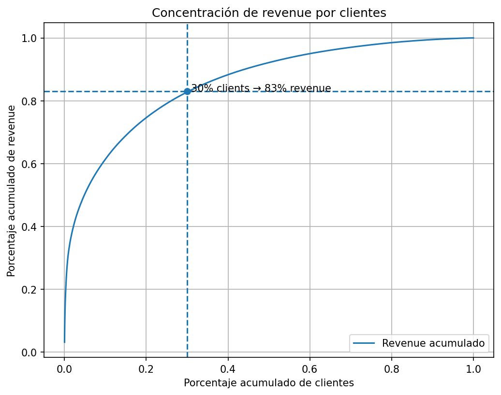
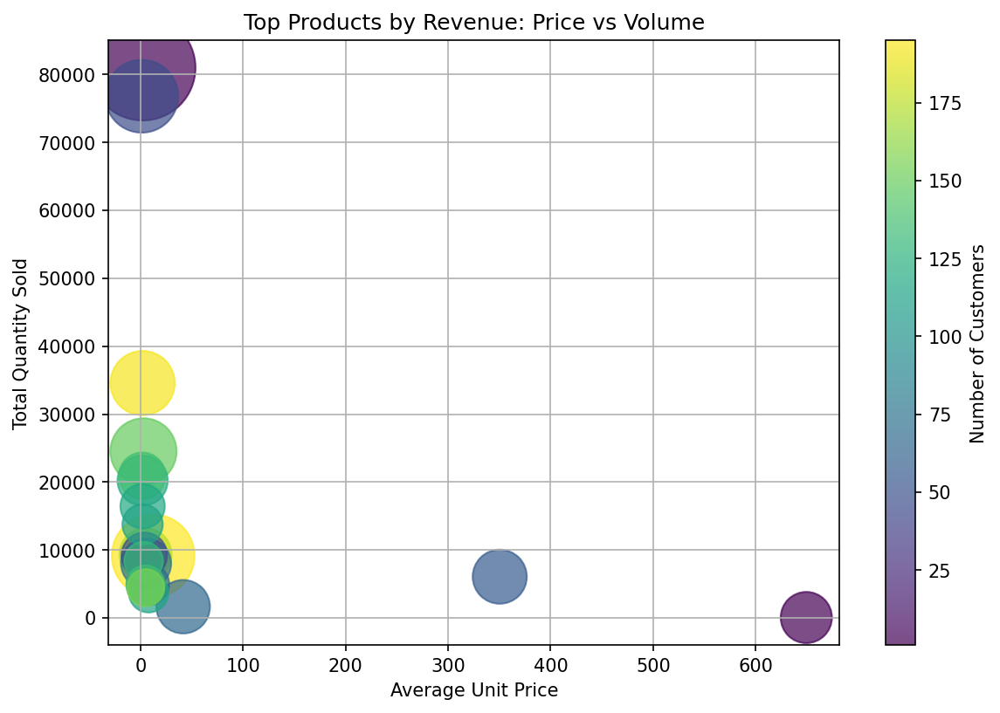
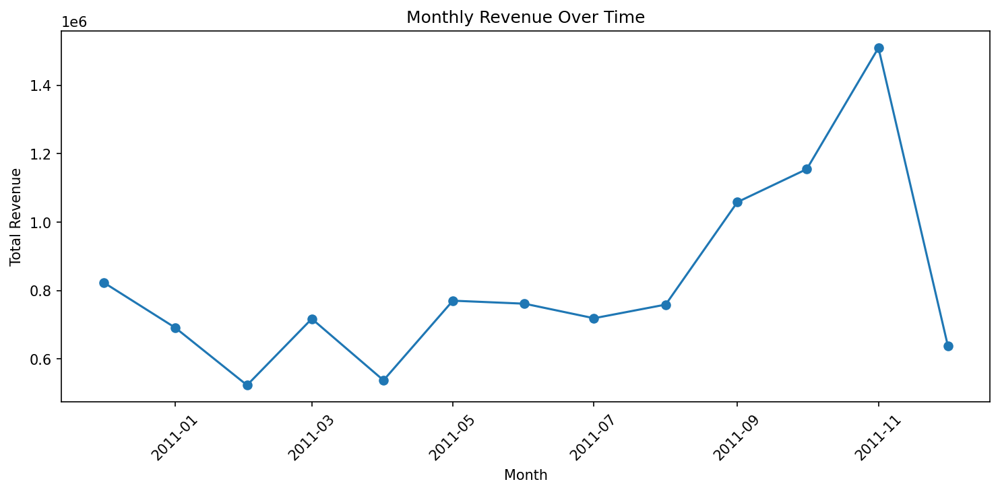
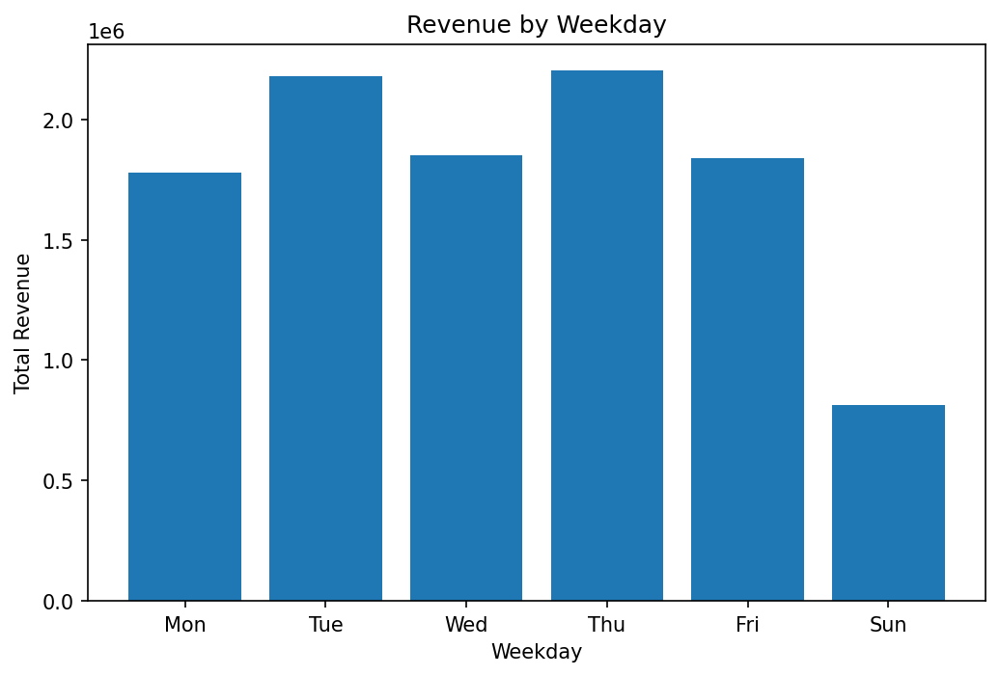

# 📊 E-Commerce Sales, Customer & Product Analysis

**Customer behavior, revenue concentration, product performance, and seasonality analysis using Python (Pandas & Matplotlib).**

---

## 📌 Project Objective

Analyze e-commerce transactional data to understand:

- Revenue concentration across customers  
- Customer recurrence and value segmentation  
- Product performance and revenue drivers  
- Sales seasonality (monthly, weekly, hourly)

The goal is to identify **key customers, strategic products, and temporal demand patterns** that can inform business decisions related to retention, pricing, and risk management.

---

## 📦 Dataset Overview

- **Source:** Online Retail Dataset (Kaggle)
- **Records:** ~540,000 transactions  
- **Granularity:** One row per product per invoice  
- **Time span:** December 2010 – December 2011

Each transaction includes quantity, unit price, invoice date, customer ID, country, and product description.

---

## 🧹 Data Cleaning & Preparation

Before analysis, several data quality issues were identified and addressed:

- **Data types**
  - `InvoiceDate` converted to datetime format (date and time preserved)
  - `CustomerID` cast to nullable integer
- **Missing values**
  - ~25% of transactions have missing `CustomerID` (explicitly acknowledged as a limitation)
- **Cancellations & returns**
  - Identified through negative quantities and invoice numbers starting with `"C"`
  - Represent less than **3% of total records**
  - Excluded to define a clean dataset of *real sales*
- **Outliers**
  - Extreme values detected in `Quantity` and `UnitPrice`
  - More than 99.5% of observations fall below:
    - Quantity ≤ 160 units
    - Unit price ≤ 25 monetary units
  - The full dataset was preserved for global metrics
  - A capped version was used for exploratory analysis and visualizations
- **Feature engineering**
  - `Revenue = Quantity × UnitPrice`
  - Temporal features extracted: year-month, weekday, and hour

---

## 📊 Exploratory Data Analysis

### 1️⃣ Revenue Concentration (Pareto Analysis)

Revenue is highly concentrated among a small subset of customers:

- **Top 10% of customers → ~61% of total revenue**
- **Top 20% → ~75%**
- **Top 30% → ~83%**
- Bottom **70% of customers generate only ~17% of revenue**

This confirms a strong Pareto effect and a high dependency on high-value customers.

---

### 2️⃣ Customer Recurrence & Value

Customers were segmented by purchase frequency:

- 1 purchase  
- 2–3 purchases  
- 4–10 purchases  
- **10+ purchases**

**Key findings:**

- One-time buyers are the most numerous
- Customers with **10+ purchases**:
  - Are a small minority
  - Have the **highest average ticket**
  - Generate **~6× more revenue per customer** than the 4–10 purchase group

This shows that revenue is driven more by **retention and recurrence** than by customer volume alone.

---

### 3️⃣ Linking Revenue Concentration and Recurrence

Two complementary perspectives emerge:

- **Top 5 customers → ~10–11% of total revenue**
  - 4 out of 5 belong to the **10+ purchases** segment
  - One exceptional case shows very high spending with only 2–3 purchases
- **Top 10% of customers (~400+) → ~60% of revenue**
  - A statistically robust and scalable segment

Both views are valid:
- *Top N customers* highlight concentration risk  
- *Top 10% of customers* define a strategic customer base

---

### 4️⃣ Product Analysis

Products were analyzed by:

- Total revenue
- Units sold
- Number of customers
- Average unit price

Three clear product profiles were identified:

#### 🔹 Core (Volume) Products
- Low-to-mid unit price (below 100 monetary units)
- Purchased by many customers
- Revenue driven by large sales volumes
- Represent the stable backbone of the business

#### 🔹 Premium Products
- Very high unit prices (300–600+ monetary units)
- Lower sales volume but broad customer base
- Revenue driven primarily by price rather than quantity
- Represent scalable and high-value opportunities

#### 🔹 Sensitive Products
- Very high revenue
- Purchased by very few customers (sometimes a single buyer)
- Often driven by extreme quantities
- Pose significant **revenue concentration risk**

---

### 5️⃣ Seasonality Analysis

#### 📆 Monthly Seasonality
- Dataset spans **13 months** (Dec 2010 + full 2011)
- After correcting year-month aggregation:
  - The first 9 months fluctuate within a common revenue range
  - A strong growth phase appears in the following months
  - Peak revenue occurs in the penultimate month
  - The final December shows a sharp drop, likely due to incomplete data

---

#### 📅 Weekly Seasonality
- **Sunday** consistently shows the lowest revenue
- No Saturday data is present in the dataset
- Weekdays concentrate the majority of sales activity

---

#### ⏰ Hourly Seasonality
- Sales occur between **6:00 and 20:00**
- Revenue rises sharply from 8:00
- Peak activity around **10:00**
- Sustained activity until approximately 15:00
- Gradual decline afterward

---

## 💡 Key Insights

- Revenue is extremely concentrated among a small group of customers
- High-recurrence customers are the most valuable segment
- Product revenue is driven by different mechanisms (volume vs price)
- Some high-revenue products pose concentration risk
- Clear temporal demand patterns exist at monthly, weekly, and hourly levels

---

## 🎯 Business Implications

- Prioritize **retention strategies** for high-recurrence customers
- Protect relationships linked to **sensitive products**
- Invest in and expand **core and premium products**
- Align marketing, staffing, and operations with observed seasonality
- Avoid generalized discount strategies that may harm revenue concentration

---

## 🛠 Tools Used

- Python (Pandas, NumPy, Matplotlib)
- Google Colab
- GitHub
